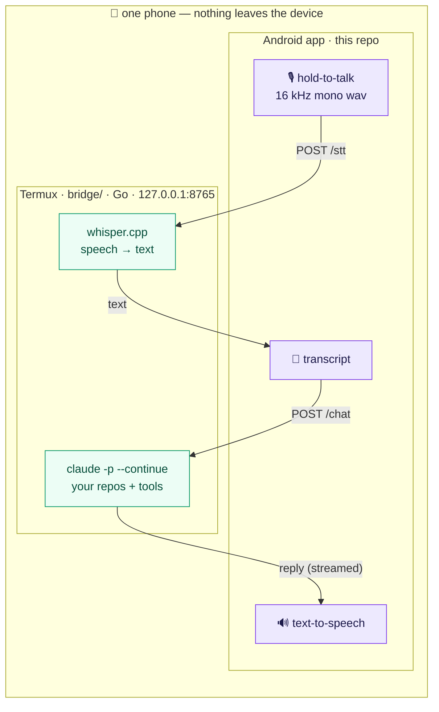

# claude-voice

A native Android app for **talking to a coding agent on your phone**. Push to
talk, watch the transcript, hear the reply spoken back. The agent itself is the
`claude` CLI running in Termux on the same device — so it has your repos and
tools — and the app is a thin voice front-end that reaches it over localhost.

<p align="center">
  
  &nbsp;&nbsp;
  
</p>

<p align="center">
  <em>Left: hold-to-talk, watch the agent stream edits, hear the reply. Right: switch between agents, one per repo.</em>
</p>



Why this shape: no Android app is itself a coding agent — the brain must run in
Termux where the files and tools are. Push-to-talk removes the speech-endpoint
cutoff that plagues hands-free voice: you control exactly when audio starts and
stops.

## Layout

- `app/` — the Android app (Kotlin, AGP 8.5.2, minSdk 23). Records 16 kHz mono
  PCM on hold-to-talk, POSTs to the bridge, shows the transcript, speaks the reply.
- `bridge/` — the Termux-side localhost server, a single static Go binary
  (`claude-voice-bridge-arm64`): manages N agents (one per dir), `/stt` via
  whisper.cpp, `/chat` via the `claude` CLI. See the [Bridge](#bridge) section.
- `.drone.jsonnet` — CI: builds the APK in `runmymind/docker-android-sdk`,
  publishes to GitHub releases on tag, ships the APK to the artifact server.

## Prerequisites (Termux side)

- whisper.cpp built at `~/storage/projects/whisper.cpp` and a model at
  `~/whisper-models/ggml-base.en.bin`
- `claude` CLI on `PATH`

## Quick start

1. Termux: `cd <your-repo> && ./claude-voice-bridge-arm64`
2. Install the app APK (from CI artifacts or a local build).
3. Open the app, confirm the bridge URL (`http://127.0.0.1:8765`), grant the mic
   permission, hold the button, speak, release.

## Build

CI builds it (see `.drone.jsonnet`). Local/manual builds use the Android SDK; the
project targets gradle 8.7 (wrapper vendored) and `compileSdk 34` /
`build-tools;34.0.0`.

## Bridge

The Termux-side localhost server (`bridge/`) is a single static Go binary
(`CGO_ENABLED=0`, no runtime deps). The Claude agents run **here**, where your
repos and tools live; the app is only voice-in / speech-out. It listens on
`http://127.0.0.1:8765` — loopback is reachable cross-app on Android, so the app
on the same phone connects to it.

Build it with `./bridge/build.sh`, or by hand:

```bash
cd bridge && go build -o claude-voice-bridge ./cmd/claude-voice-bridge            # native
CGO_ENABLED=0 GOOS=android GOARCH=arm64 go build -o claude-voice-bridge-arm64 ./cmd/claude-voice-bridge  # release (Termux/Android)
```

### API

| Method | Path        | Body                | Returns                          |
|--------|-------------|---------------------|----------------------------------|
| GET    | `/health`   | —                   | `ok`                             |
| GET    | `/agents`   | —                   | `[{id,name,dir,branch,dirty}]`   |
| POST   | `/agents`   | `{"dir":"~/repo"}`  | current agent list               |
| DELETE | `/agents/<id>` | —                | current agent list               |
| GET    | `/ls?dir=`  | —                   | `{dir,parent,dirs}` (folder browse) |
| POST   | `/stt`      | WAV bytes           | transcript (whisper.cpp)         |
| POST   | `/chat`     | `{"text","agent":id}` | agent reply (`claude -p`)      |
| GET    | `/voices`   | —                   | installed Piper voices (`[]` if off) |
| POST   | `/tts`      | `{"text","voice"}`  | WAV audio (Piper) or 501 if off  |

One agent per directory; each keeps its own `claude --continue` conversation, so
per-dir continuity is automatic.

### Config (env)

- `VOICE_PORT` (default `8765`), `VOICE_HOST` (default `127.0.0.1`)
- `VOICE_PERM` claude permission mode (default `bypassPermissions` for hands-free
  tool use; set `acceptEdits` to gate Bash/tool calls — note gating makes
  tool-using turns stall, since headless mode can't answer prompts)
- `VOICE_TIMEOUT` seconds before a stuck agent turn is aborted (default `1800`)
- `VOICE_WORKDIR` directory of the initial agent (default: home)
- `WHISPER_BIN`, `WHISPER_MODEL` paths to the whisper.cpp cli + ggml model
- `PIPER_BIN` (default `~/piper/piper`), `PIPER_VOICES` (default `~/piper-voices`),
  `PIPER_MODEL` (default: first voice). Run `./install-piper.sh` to set these up.

### Piper (neural voices, optional)

If a Piper engine is present at `~/piper`, the bridge enables `/tts` and `/voices`;
otherwise `/tts` returns 501 and the app falls back to Android TTS. Piper runs as a
glibc binary via `grun`, so `pkg install glibc-runner` is required. Install with
`./install-piper.sh`. Add voices by dropping `<name>.onnx[.json]` into `~/piper-voices`.
